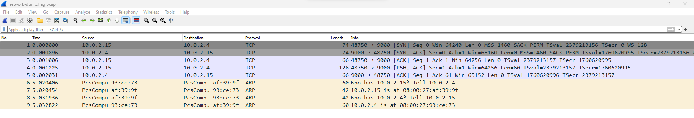
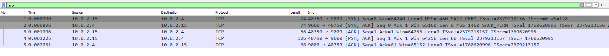
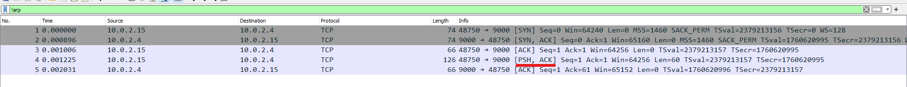
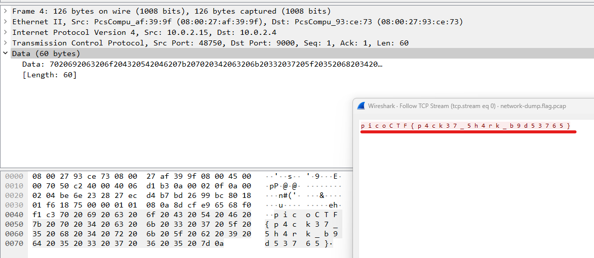

# Packets Primer

https://play.picoctf.org/practice/challenge/286

1. Download the packet capture

2. Open with wireshark

  

3. Filter ARP protocols bc they're just messages relating IP and MAC addresses

   ```
   !arp
   ```

    

4. Check the TCP packet's data containing <code>[PSH, ACK]</code> bc PSH means there's a data inside

  

5. Get the flag

  
