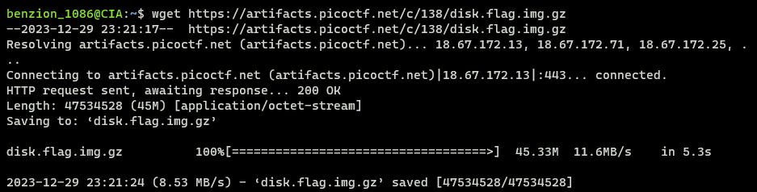
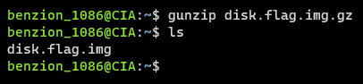
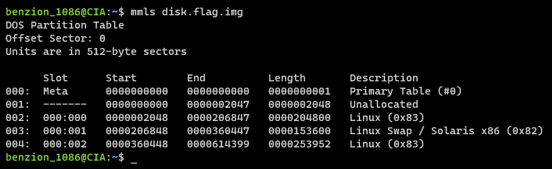
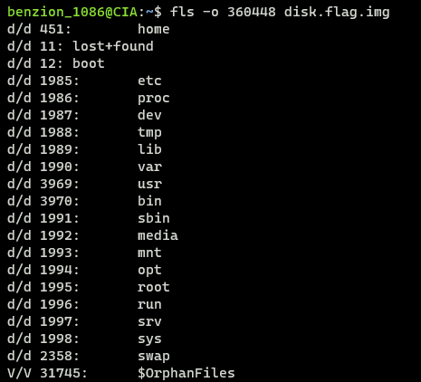
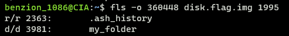
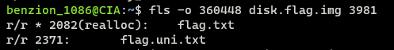
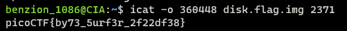

# Sleuthkit Apprentice

https://play.picoctf.org/practice/challenge/300

1. Download the zip disk file

   ```
   $ wget [disk_file_url]
   ```

   

2. Unzip the disk file

   ```
   $ gunzip disk.flag.img.gz
   ```

   

3. List the partitions

   ```
   $ mmls disk.flag.img
   ```

   

   We can see that the main partition potentially is the 4th one bc it has the largest size

   To make sure even more, we can try listing the potential main partition to see if it really is the main partition

   ```
   $ fls -o 360448 disk.flag.img
   ```

   

   From the list, we can see that it has lots of common files and dirs like linux OS so we can safely say that it's indeed the main partition

4. Find the flag in the disk by trying to list all the dirs but we can see that the dir containing the flag is the <code>root</code>, more specifically inside <code>my_folder</code>

   ```
   $ fls -o 360448 disk.flag.img 1995
   ```

   

   ```
   $ fls -o 360448 disk.flag.img 3981
   ```

   

5. Get the flag

   ```
   $ icat -o 360448 disk.flag.img 2371
   ```

   
