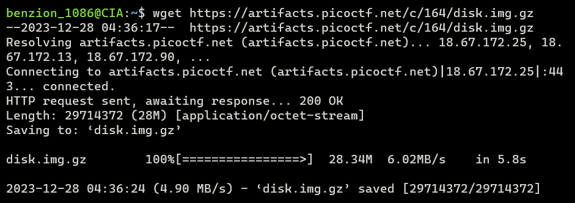
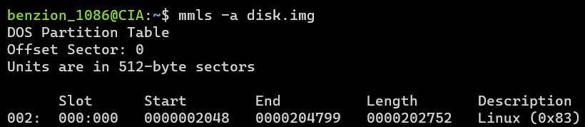
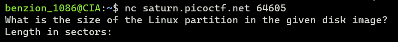
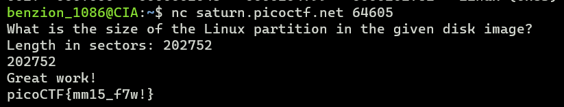

# Sleuthkit Intro

https://play.picoctf.org/practice/challenge/301

1.  Download the disk image

    ```
    $ wget [disk_image_url]
    ```

    

2.  Unzip the disk image

    ```
    $ gunzip disk.img.gz
    ```

3.  Get the partitions' sizes using <code>mmls</code>

    ```
    $ mmls -a disk.img
    ```

    

4.  Start netcat with command <code>nc</code>

    ```
    $ nc saturn.picoctf.net [port]
    ```

    

5.  Enter the size
    
