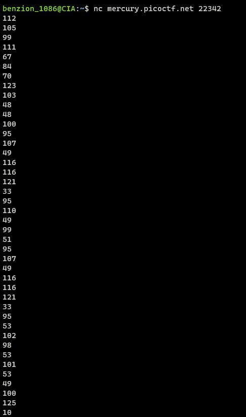
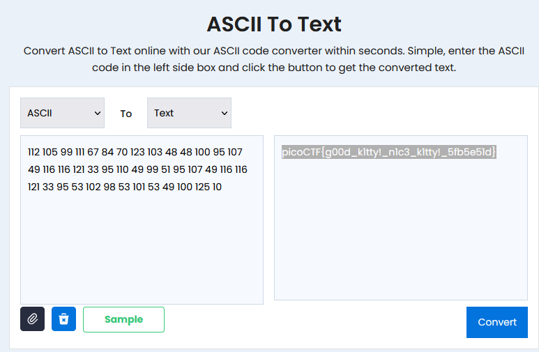

# Nice netcat...

https://play.picoctf.org/practice/challenge/156

1.  Use <code>netcat</code> to open the program

    ```
    $ nc mercury.picoctf.net 22342
    ```

    

2.  Convert the ASCII to text

    
