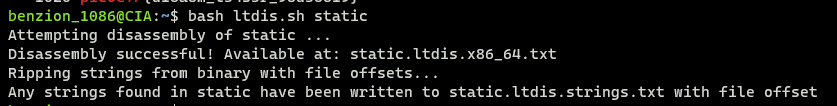
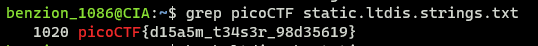

# Static ain't always noise

https://play.picoctf.org/practice/challenge/163

1. Download the required files

   ```
   $ wget [binary_url]
   $ wget [bash_script_url]
   ```

2. Run the bash script

   ```
   $ bash ltdis.sh static
   ```

   

3. Search the flag using <code>grep</code>

   ```
   $ grep picoCTF static.ltdis.strings.txt
   ```

   
