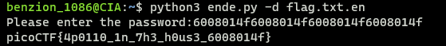

# Python Wrangling

https://play.picoctf.org/practice/challenge/166

1. Download the required files

   ```
   $ wget [python_script_url]
   $ wget [pwd_url]
   $ wget [flag_url]
   ```

2. Decrypt the flag using python script

   ```
   $ python3 ende.py -d flag.txt.en
   ```

   
