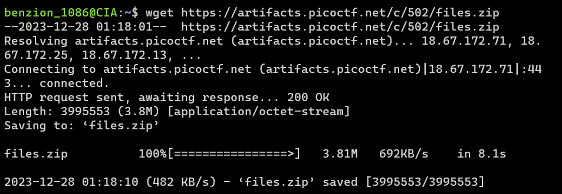
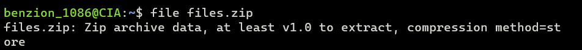
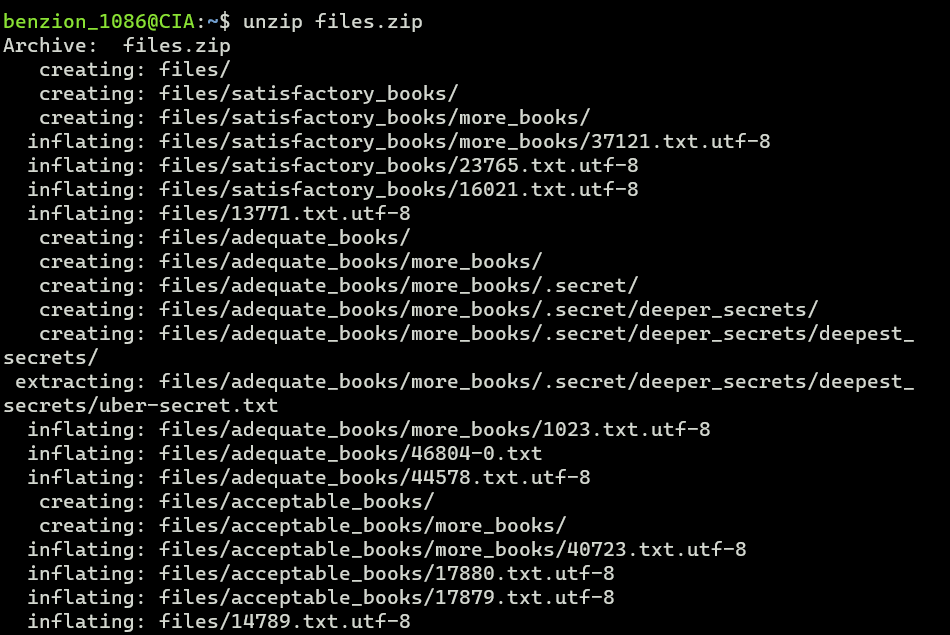
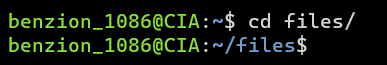
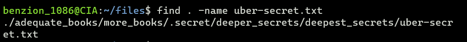
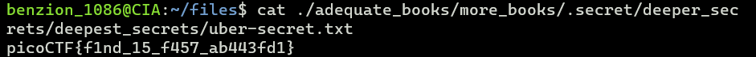

# First Find

https://play.picoctf.org/practice/challenge/320

1. Download the file

   ```
   $ wget [file_url]
   ```

   

2. Show more information about the file

   ```
   $ file files.zip
   ```

   

3. Unzip the file

   ```
   $ unzip files.zip
   ```

   

4. Change directory to files using <code>cd</code>

   ```
   $ cd files
   ```

   

5. Find the file named 'uber-secret.txt'

   ```
   $ find . -name uber-secret.txt
   ```

   

6. Cat uber-secret.txt file location

   ```
   $ cat ./adequate_books/more_books/.secret/deeper_secrets/deepest_secrets/uber-secret.txt
   ```

   
