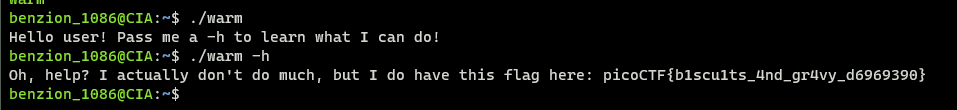

# Wave a Flag

https://play.picoctf.org/practice/challenge/170

1. Download the program

   ```
   $ wget [program_url]
   ```

2. Change the program to executable

   ```
   $ chmod +x warm
   ```

3. Run the program help

   ```
   $ ./warm -h
   ```

    
