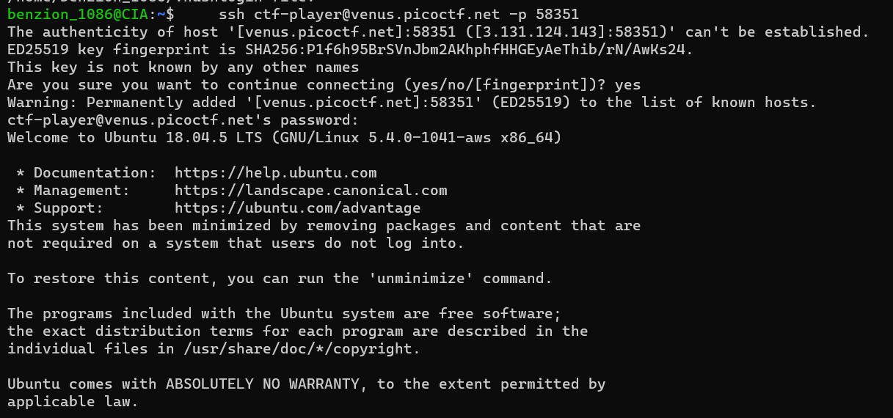
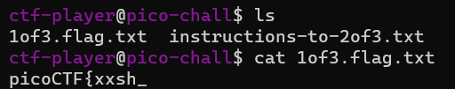
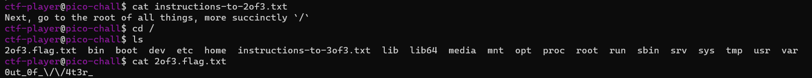
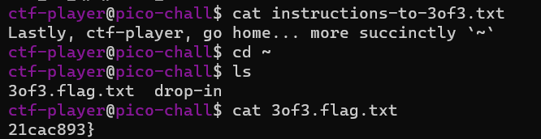

# Magikarp Ground Mission

https://play.picoctf.org/practice/challenge/189

First, we have to click "launch instance"

Then, we use ssh to interact with the instance

Here is the general way of using ssh

```
$ ssh [username]@[domain_name] -p [port]
```



First, we have to <code>ls</code> then just follow the instructions until we have the complete flag




