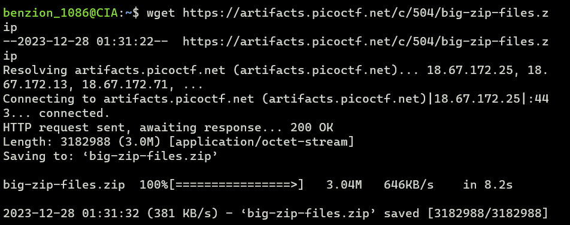
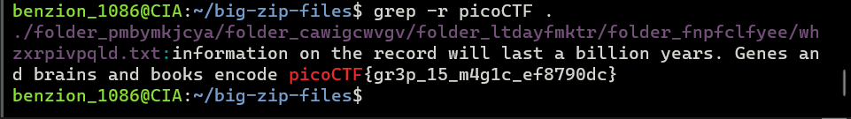

# Big Zip

https://play.picoctf.org/practice/challenge/322

1. Download the file

   ```
   $ wget [file_url]
   ```

   

2. Unzip the file

   ```
   $ unzip big-zip-files.zip
   ```

3. Change dir to big-zip-files using <code>cd</code>

   ```
   $ cd big-zip-files
   ```

   

4. Grep all files to match "picoCTF" flag format within the dir (including all files inside a dir)

   ```
   $ grep -r picoCTF .
   ```

   
