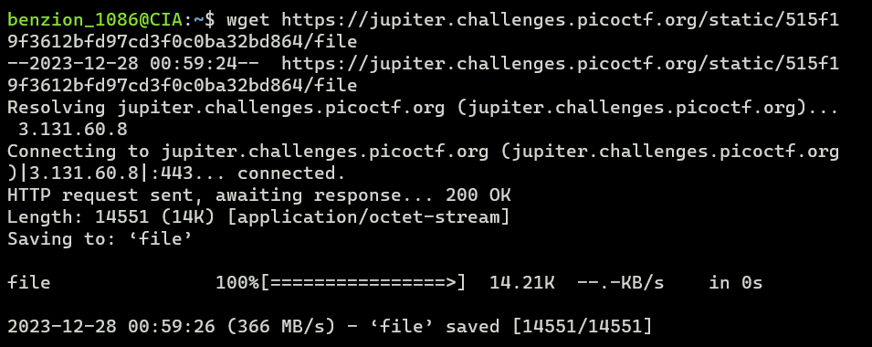
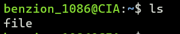
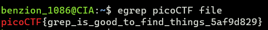

# First Grep

https://play.picoctf.org/practice/challenge/85

1. Download the file using <code>wget</code>

   ```
   $ wget [file_link]
   ```

   

2. Check if the file is downloaded using <code>ls</code>

   ```
   $ ls
   ```

   

3. Get the flag using <code>egrep</code>

   ```
   $ egrep picoCTF file
   ```

   
